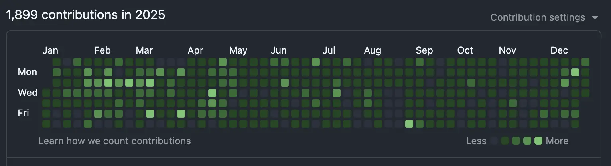

I'm an independent AI consultant, trying to grow my business. This is my annual review. If it's me rereading this, welcome back. This is Dylan from 2025.

## Money & work

This was the year I made the most money. I grew my revenue by 13%. Growth came mostly from working on more projects with previous clients. I worked on 11 projects, with 6 clients. I did 6 deliverable-based projects and 5 time-based projects. Deliverable-based projects accounted for 57% of my revenue.

It became obvious to me that expanding your projects with existing clients is a lot easier than selling to new clients. 

I also reduced costs by 11%. Most of the cost reduction came from firing a frontend developer that I had hired in 2024. I let him go because of AI progress. I could use Claude Code to get a better, cheaper, and faster version of the same services he was providing me. It didn't make financial sense to keep him on board.

Still, I felt bad about it. He was a good guy, but he wasn't a good fit. I also felt I didn't do a good job during the hiring process. This cost me resources and time, so I'll be more careful with the next hires.

This year I more than doubled my number of commits and wrote code 312 days of the year. It helped that some of the paid work I did was the [econagents](https://github.com/IBEX-TUDelft/econagents) open source Python library. Sometimes I cheated, because I was tired and all I did was merge Dependabot's PRs. I feel like I coded and learned quite a bit more than last year, but not as much as it looks.

Throughout the year, a recurring dilemma was whether to build a product or keep focusing on services. For the first half of the year, I dedicated quite a bit of time to Namemancer, a tool meant to help trademark lawyers speed up their research process. However, I kept getting more market pull for services and struggled to make meaningful progress on it. I kept hoping I could magically advance on both fronts, but eventually had to face reality and decided to kill it. It taught me to be more disciplined about reining myself in to avoid losing focus.

## Life

In late February, my wife, Maria, and I moved to Cork, Ireland for three months. This got off to a rocky start. We had been having some differences since the end of 2024, and the first few weeks in Ireland put this on steroids. We've been together for 15 years, eight of them married. We've had our share of difficult stretches, but this was one of the toughest.

Through many tough conversations and commitment from both sides, we successfully worked through it and grew closer together. Ireland went from a rocky start to one of the best experiences we've had as a couple. We traveled around the country, went for runs during sunset, tried every dairy product available, and really became a team again. We still cherish our time in Ireland, and even considered moving there!

We went back to Madrid in May, and then in July we moved to Salamanca, a small city to the north of Madrid. Maria found a good job opportunity, and since I can work from anywhere, we decided to pack our bags and go. We spent a good chunk of July and August moving. We went from a small, old 2-bedroom apartment to a newly renovated 4-bedroom apartment. It was a good change, especially for me, given that I work from home.

## Health

I did more weight training this year but less cardio. After we moved to Ireland, I started going to the gym instead of training at home. I kept doing this even after coming back to Spain. It's been good for my mental health, as otherwise I'd often spend days without leaving my house.

My RHR is now at 56 bpm and VO2 max is at 46 ml/kg/min. Both are pretty much the same compared to last year. I think I need to include more cardio and improve my rest, to improve these markers. 

The biggest health concern this year was sleeping issues and neck/back pain. The sleeping issues started a few weeks after I arrived in Ireland. It was a mix of stress and working from the same room where I was sleeping. On good days it takes me 15–20 minutes to fall asleep. On bad days, it can take me 2–3 hours. I've been able to improve this over time, but I still need to be careful with my sleep hygiene.

I have some small protrusions in my neck that get worse when I don't sleep well or exercise. The last 3 months of the year were pretty stressful, so this got bad. It improved after I changed my home desk setup, did rehab exercises, and started going to the physio regularly.

## What's next?

Going forward, my goal is to dedicate myself fully to consulting. Some exciting projects have come up for this year, but I don't want to jinx it, so I won't talk about those until my next personal snapshot.
