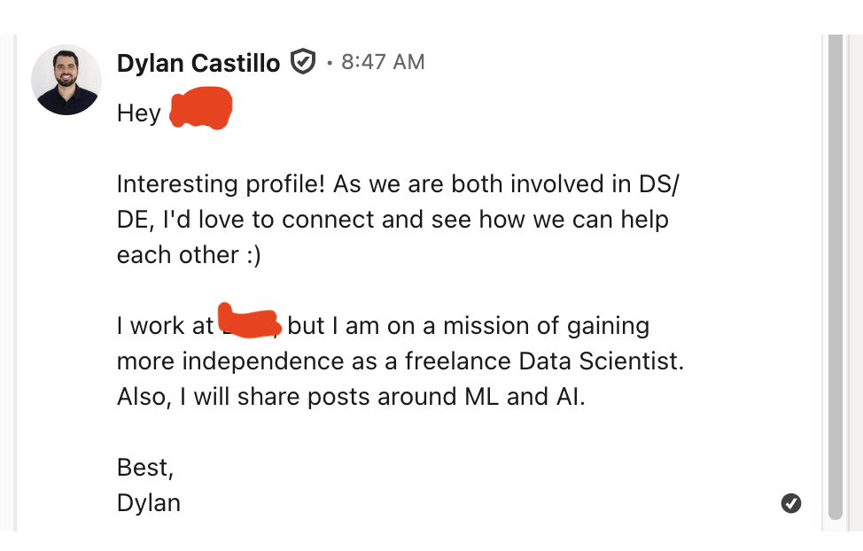
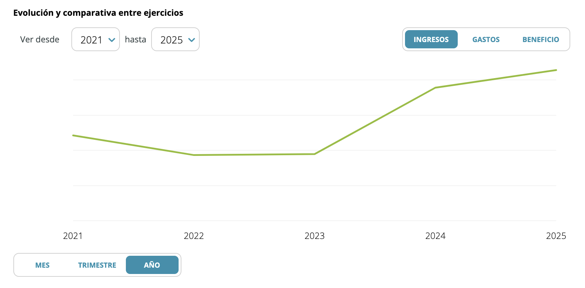

Five years ago, freelancing felt like arbitrage: do the same work I was already doing, charge much more for it, and barely change my lifestyle. So I left my full-time job in the middle of the pandemic and gave it a shot.

Since then, I’ve worked with startups, scaleups, public institutions and global organizations. I moved from data science and ML into LLMs and AI products. Freelancing gave me more freedom, more variety, and more time to work on the things I care about. But it also came with uncertainty, a constant pressure to sell, and a ceiling I’ve struggled to push past.

This is my recap of how I got in, how the money worked, where I found clients, and what I’d do differently.

## How I got into freelancing

I started thinking about freelancing in 2019, two years before I landed my first contract. That year, I joined a platform that promised you a better-paying job in exchange for a cut of your future earnings. The idea was simple: they would introduce you to people already doing the kind of work you wanted to do, and those people would help you land a similar job.

In practice, I barely got any help from the platform. But they did suggest a few introductions. The most interesting one was with a freelance data scientist.

In one of our first chats, my newly appointed mentor, mentioned almost in passing that he was charging over €500 a day. That blew my mind. He was doing the same work I was doing, but making much more money. I asked him how to find a freelance contract, and he told me to more or less spam people on LinkedIn.

So that's what I did. I set up a bot that messaged pretty much everyone involved in Data Science in Europe: DS managers, recruiters, and a few confused interns. Most people ignored me. A few wrote back to ask whether what I was doing was even legal. Most recruiters dismissed me because I had no prior freelancing experience to point to.

Not surprisingly, the approach didn't bear fruit. I eventually realized my mentor wasn't reallty committed. His plan was basically for me to spray LinkedIn messages across Europe and hope something worked. If I landed a job, he’d get a nice bonus. If LinkedIn blocked my account, that was my problem. So we parted ways.

Two years later, in 2021, the freelance market in Europe exploded. A friend at the European Commission put me in touch with a recruiter, and I quickly got an offer. I also got into multiple hiring processes for contractors around the same time. My first gig was with the European Commission, and shortly after I switched to Deliveroo.

All it took was a failed spam campaign, two years of waiting, and a pandemic.

## What kind of work I do

Over the last five years, I’ve worked across data science, data engineering, ML, backend systems, and LLMs and AI products.

Early on, the work was mostly classic data and ML. I built clustering algorithms to identify trends across European research projects, worked on the NLP layer of a public-sector knowledge database, and spent close to two years building data pipelines that processed millions of data points a day to track competitors and improve the models behind them.

Since 2023, most of my work has shifted to LLMs and AI products. I’ve built AI workflows and agents for B2B clients, helped startups ship AI features, supported academic research groups working on AI, taught courses on these topics, and led technical work on personalization and experimentation.

In practice, I’ve become an AI engineer / data scientist / data engineer / backend engineer hybrid, with some product management mixed in. I get hired because I can get things over the finish line, not because I’m the obvious expert in one specific area. This is one of the biggest trade-offs of my freelancing career: for better or worse, I’m a generalist.

## The good and bad of freelancing 

I wouldn't trade the experience I've gained from freelancing for a full-time job. But it has had its rough patches.

**The good parts**

The biggest upside is freedom. I work fully remotely from home, can skip most of the useless corporate meetings, and can often set my own schedule. Clients mostly care that I deliver value. I've always thought that most of the 360 stuff, the recurrent "how are you feeling?" meetings, and similar things are mostly performative. So I'm happy I don't need to attend them.  

The second upside is variety. I get to wear many different hats, sometimes within the same week. On one project I'm acting as a PM, scoping a product and figuring out what should be built. On another I'm a data scientist, planning and analyzing experiments. On another I'm an AI engineer, shipping features for workflows or agents. I love the intellectual range of things I get to do.

The third upside is the room it has given me to work on my own things. Because I could work intensely for a few months, save enough to coast for the rest of the year, and then step away, I had real time to try out business ideas and side projects. That's how I ended up launching several ideas: Namemancer, [AItheneum](https://aitheneum.iwanalabs.com/), [Kasipa](https://kasipa.com/), and Lystinct. None of them worked out, but I got a chance to try them out!

**The downsides**

The first downside is uncertainty. Compared to full-time employees, I'm always operating with shorter horizons. Projects typically run three to six months, and I rarely know in advance whether a contract will be extended — or whether I even want to stay past it. That forces me into a permanent "always be selling" mode, where part of my brain is constantly scanning for the next gig even while I'm fully engaged with the current one. It gets tiring in a way that took me a while to recognize.

The second downside — and this one is on me — is that I never specialized nor found a way to position myself so as not to be just another freelancer. My rates did grow over the years, but I've hit a ceiling I cannot push past. Clients hire me because I'm a "get-things-done" type of guy, but not because I'm *the* search guy, or *the* recommendation engines guy, or *the* AI agents guy. I've left real growth on the table by never going too deep into something. 

## How much do I charge 

My first freelance contract paid €350 a day. From there, my rates grew quickly. For the last few years, I’ve usually charged between €600 and €900 a day. For very short engagements, I generally charge more. In the US or parts of Northern Europe, good freelancers can definitely do better.

For a bit of market context, I once took part in a survey of AI freelancers. Among the Europeans in that group, median yearly take-home was around €85k. For the US-based freelancers, it was closer to $150k. If you want to freelance from Europe, client location matters a lot. Northern European clients usually pay much better than Southern European ones.

I've also experimented with switching from day rates to deliverable-based pricing on certain projects, and I generally prefer it. When the contract is structured around an outcome rather than time, my effective rate goes up, and my incentives and the client's incentives line up. The client doesn't care much about how many hours I'm putting in. They care about what they get. 

The only risk is the scope. If you misjudge the work, you can accidentally sell yourself a very stressful unpaid internship.

Every year since I started freelancing, I’ve made quite a bit more than I did in my last full-time job. But my income has still varied a lot depending on how much time I chose to spend on client work. In 2022 and 2023, I spent a lot of time on business ideas (that didn't work!), and that shows in the numbers. In 2024 and 2025, I worked my ass off. That shows too.

I like that freelancing is quite meritocratic in that sense. Work hard, and you will be rewarded accordingly. 

## How I find gigs

These days, I have a decent number of recruiters and past clients who stay in touch about projects. But it took a few years, and a few different channels, to get here.

In the early days, a lot of it came from being active on LinkedIn. Some of my posts got good traction. For example, [Ask Seneca](https://seneca.dylancastillo.co/), a small demo that showcased a simple RAG system in the early days of LLMs, did pretty well. It ended up on the front page of Hacker News and got mentioned in The Economist. Other projects had similar effects. That visibility translated into people reaching out about work.

Another big channel has been personal relationships. Friends from [Entrepreneur First](https://dylancastillo.co/posts/my-entrepreneur-first-experience.html), past clients, and former employers have reached out when they had projects I'd be a good fit for. These are the best types of leads because they require very little effort to close. 

I'm also in a couple of freelance platforms (á la [Toptal](https://www.toptal.com/)). They can be useful for lead flow, but over time the rates have gotten worse. Platforms make comparison very easy, so you become a commodity. That is bad for your pocket.

What I don't do much of these days — and probably should — is active content marketing. I once heard [Jason Liu](https://x.com/jxnlco/) summarize the best way to charge high consulting rates: “be famous.” I agree. There’s a world of difference between someone wanting to hire “an AI engineer” and someone wanting to hire Dylan Castillo. No one can outcompete me at being me.

I've gotten a bit lazy on that front because I'm rarely out of projects. But I’m probably missing out on better opportunities, clearer positioning, and higher rates by not putting more work into the world.

Finally, if I had to give one piece of advice for finding freelance work, it would be this: use your network. And by that, I don’t mean LinkedIn randos. Reach out to former colleagues, old bosses, past clients, and people who already know your work. That’s the simplest way to get started. Most people avoid it because it feels awkward.

## What's next for me

I've never felt this uncertain about the future – for reasons both good and bad.

On the optimistic side, [Iwana Labs](https://iwanalabs.com/) is starting to change. Until now, it has mostly been a vehicle for my own freelance work, with occasional projects where I brought in collaborators. Some of those collaborations have kept growing, and by the end of the year, I hope to go from a one-man show to a small, focused team. 

The goal is not just to become an AI development agency that sells whatever clients ask for. We already have a few areas where we've built expertise over the years, and we’re trying to position ourselves around them. But that positioning will take time to earn.

On the scary side, I genuinely don't know what's going to happen to the software industry. The changes from AI have been amazing to watch. But my best guess is that we're heading toward a much more unequal distribution of the profits. I worry that the economics are shifting from maybe the top 20% capturing 80% of the value to the top 1% capturing 99% of it. 

We've already seen the [$1B one-man company](https://www.nytimes.com/2026/04/02/technology/ai-billion-dollar-company-medvi.html?unlocked_article_code=1.X1A.fHR4.4vekZY08eLvB&smid=url-share) and companies with [crazy growth rates](https://sacra.com/research/cursor-at-100m-arr/). Work that used to require a full team can increasingly be done by fewer people with better tools. Maybe the amount of work to be done will keep growing even faster than the supply of people able to do it. I hope so. But I’m not sure.

When AI gives everyone the ability to build, being “pretty good at building” becomes less valuable. You need taste, distribution, deeper expertise, and stronger relationships. 

And honestly, I have to ask myself whether I’ll make it into that top 1%. I’m optimistic about my skills, but the real world doesn’t care about that. There are tons of amazing, highly motivated people out there. We’re in an industry with almost no barriers to entry, where the money has been good so far, and where AI can already do a lot of the work. What was already an extremely competitive industry just got much more competitive.

So the next chapter is partly about responding to all of that. Finding the right people to grow with, and figuring out where we can plant a flag. Five years in, I love what freelancing has taught me and the opportunities it has given me: the freedom, the variety, and the time to build my own things. But the next five years will need to look different from the last five if I want to come out the other side of what's coming.   
