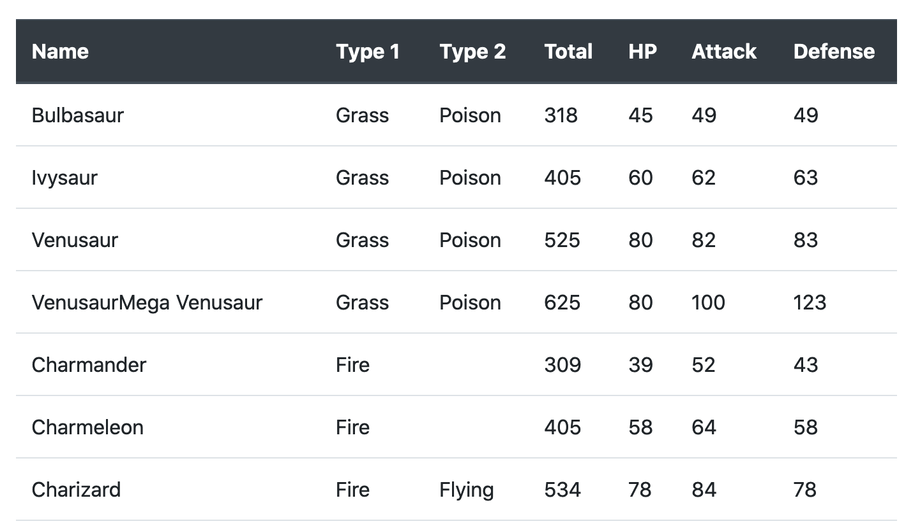

A few days ago, I was looking for courses that were free or discounted due to the COVID-19. I thought that others might be doing the same, so I decided to compile some resources and publish them online.

I started compiling the courses using a Google Sheet and was planning on sharing it after I had enough resources. However, something was bothering me. Opening sheets on a mobile suck and most people use their phones for browsing the internet. I thought I could do better.

The thing is that I have little experience in web development. Also, I didn't want to dedicate more than a few hour on developing and launching the site. So I decided to build something quickly.

Here are the requirements I set for building the site quickly and the approach I took to meet them:

**Product Requirements:**

1. The site should load fast and look good on mobiles (or at least better than a Google Sheet)
2. I need to be able to add or remove resources fast and without much hassle. Keep in mind that I may want to add bit more interactivity from the client side in the future.
3. Use Python as much as possible (and as little as possible of HTML/CSS/JS)
4. It should take me only a few hours to develop and launch
5. Maintenance costs should be _very very_ close to zero 😛

**Approach:**

1. Used of Bootstrap (only CSS, excluded JS components)
2. Managed content using Google Sheets. I used the Google Sheets API for getting content programmatically into the site. It’s easy to make a web API from a Google Sheet if needed.
3. Generated the site using from a basic HTML/CSS template using Jinja2
4. Hosted the site on an AWS S3 bucket + Cloudfront (for SSL certificate). Bought the domain using Route 53
5. The use that I'm doing of the AWS services fall under the Free Tier. I don't foresee that this will change anytime soon. So far, I've only invested ~15€ on the site

After a couple of hours, I launched [stayhomeandlearn.org](https://stayhomeandlearn.org/).

The rest of this article is **a tutorial on how to build a static site using Google Sheets, AWS, and Python**.

---

For this tutorial, **we will set up a script that reads data from Google Sheets, generates a static site using a predefined template, and deploys it to an S3 bucket.** This article is meant for programmers with little knowledge of web development that want to get something running quickly.

There are five sections in the tutorial: Requirements, Review Code and Jinja Template, Using the Google Sheets API, and Build and Deploy Your Site.

## Requirements

These you'll need to set up or review on your own. I added some links for that purpose.

- [Python >= 3.7](https://www.python.org/downloads/)
- [Google account](https://myaccount.google.com/)
- [Google Cloud Platform (GCP) account](https://cloud.google.com/)
- [Amazon AWS account](https://aws.amazon.com/free/)
- [AWS CLI](https://docs.aws.amazon.com/cli/latest/userguide/install-cliv2.html) (You can [use brew if you have a Mac](https://formulae.brew.sh/formula/awscli))
- [A profile configured in the AWS CLI](https://docs.aws.amazon.com/cli/latest/userguide/cli-chap-configure.html#cli-quick-configuration)
- A bit of [HTML](https://developer.mozilla.org/en-US/docs/Learn/HTML/Introduction_to_HTML/Getting_started) and [CSS](https://developer.mozilla.org/en-US/docs/Learn/CSS/First_steps/Getting_started)

## Code and Jinja Template

First, create a directory called `my_pokemon_stats` and open a terminal from there. Then, create a virtual environment and install the required packages as follows:

```bash
python3 -m venv venv
source venv/bin/activate
pip3 install boto3 gspread jinja2 oauth2client
```

Create virtual environment and install required libraries

Next, download and save these two files there: [template.html](https://gist.github.com/dylanjcastillo/61018bf4474d388e2936a84368d40d07) and [site_builder.py](https://gist.github.com/dylanjcastillo/fbbdcb83694c2334714866340442ce18). These are the building blocks for generating the site.

`template.html` is the Jinja template we will use for building the site. It's an HTML-like file where you can add logic that will be processed in Python and generate the definitive site. This file looks as follows:

```html
<!DOCTYPE html>
<html lang="en">
  <head>
    <meta charset="UTF-8" />
    <meta
      name="viewport"
      content="width=device-width, user-scalable=no, initial-scale=1.0, maximum-scale=1.0, minimum-scale=1.0"
    />
    <meta http-equiv="X-UA-Compatible" content="ie=edge" />
    <link
      href="https://stackpath.bootstrapcdn.com/bootstrap/4.4.1/css/bootstrap.min.css"
      rel="stylesheet"
      integrity="sha384-Vkoo8x4CGsO3+Hhxv8T/Q5PaXtkKtu6ug5TOeNV6gBiFeWPGFN9MuhOf23Q9Ifjh"
      crossorigin="anonymous"
    />
    <title>My Pokemon Stats</title>
  </head>
  <body>
    <header id="header">
      <div class="container text-center">
        <h1 class="pt-5 pb-1 font-weight-bold">My Pokemon Stats</h1>
        <hr />
        <p class="pt-2">
          This is a site I use to store the stats of all my Pokemon.
        </p>
      </div>
    </header>

    <section id="pokemon_table">
      <div class="container py-4">
        <div class="table-responsive">
          <table class="table table-hover">
            <thead class="thead-dark">
              <tr>
                <th scope="col">Name</th>
                <th scope="col">Type 1</th>
                <th scope="col">Type 2</th>
                <th scope="col">Total</th>
                <th scope="col">HP</th>
                <th scope="col">Attack</th>
                <th scope="col">Defense</th>
              </tr>
            </thead>
            <tbody>
              
              <tr>
                <td>{{ row["Name"] }}</td>
                <td>{{ row["Type 1"] }}</td>
                <td>{{ row["Type 2"] }}</td>
                <td>{{ row["Total"] }}</td>
                <td>{{ row["HP"] }}</td>
                <td>{{ row["Attack"] }}</td>
                <td>{{ row["Defense"] }}</td>
              </tr>
              
            </tbody>
          </table>
        </div>
      </div>
    </section>
  </body>
</html>
```

Let's break it down:

- You can safely ignore most of what's inside the `<head>` tag. It's standard HTML5 code that you'll see in most pages. However, there are just two interesting tags that we'll take a closer a look at: `<link>` and `<title>`.
- In this case, the `<link>` tag is used to import the [Bootstrap](https://getbootstrap.com/) component library. We  will use it to define simple styles for the different sections of the page and make it look good without much effort. `<title>` defines the title of the page (what you see in the browser's tab) and it is useful for SEO and social media sharing.
- Next, there's the `<header>` section inside the `<body>` tag. This is where we define the text that will appear in the page. It will look like the image below. I used standard styling from Bootstrap to center the text and added a bit of padding.


My Pokemon stats header

- Finally, we have the `<section id="pokemon_table">`. The `<div>` and `<table>` tags provide some basic styling for building a table. Next, we define the header of the table inside the `<thead>` tags. Inside the `<tbody>` tag is where Jinja does its magic
- The `` is a loop that goes through each row of the Pokemon's data. In each of the `<td>{{ row["..."] }}</td>` we get the information per row from field (e.g. Name, Type 1, Type 2). This generates something that will look as follows:



Table with Pokemon stats

Next, we have the `site_builder.py` file. This script downloads the Pokemon's data from Google Sheets, processes the data and the `template.html` file, and then uploads the resulting file to an S3 bucket.

```python
import csv

import boto3
import gspread
import jinja2
from oauth2client.service_account import ServiceAccountCredentials

AWS_PROFILE = "INSERT-AWS-PROFILE-HERE"
BUCKET = "INSERT-BUCKET-NAME-HERE"
WORKBOOK = "INSERT-WORKBOOK-NAME-HERE"


def download_data():
    """Download data using the Google Sheets API"""
    scope = [
        "https://spreadsheets.google.com/feeds",
        "https://www.googleapis.com/auth/drive",
    ]
    credentials = ServiceAccountCredentials.from_json_keyfile_name(
        "credentials.json", scope
    )
    client = gspread.authorize(credentials)

    worksheet = client.open(WORKBOOK).get_worksheet(0)
    sheet_values = worksheet.get_all_values()

    print(f"Downloading: {worksheet.title}")
    with open("my_pokemon_stats.csv", "w") as f:
        writer = csv.writer(f)
        writer.writerows(sheet_values)


def generate_site():
    """Generate site in local directory"""
    print("Process data and build site")

    template_loader = jinja2.FileSystemLoader(searchpath="./")
    template_env = jinja2.Environment(loader=template_loader)
    template = template_env.get_template("template.html")

    with open("my_pokemon_stats.csv") as csv_file:
        csv_reader = csv.DictReader(csv_file)
        data = [row for row in csv_reader]

    output = template.render(data=data)

    with open("index.html", "w") as f:
        f.write(output)


def deploy_site():
    """Deploy site S3 bucket"""
    print("Upload data to S3")
    session = boto3.Session(profile_name=AWS_PROFILE)
    s3 = session.resource("s3")
    s3.Bucket(BUCKET).upload_file(
        Filename="index.html", Key="index.html", ExtraArgs={"ContentType": "text/html"}
    )


if __name__ == "__main__":
    download_data()
    generate_site()
    deploy_site()
```

The code is structured in 3 functions: `download_sheets`, `generate_site`, and `deploy_site`. We will fill the details for accessing AWS and the Google Sheets API in the next sections.

## Using the Google Sheets API

Follow these steps to download the Pokemon's data using the Google Sheets API:

1. Create a Workbook in Google Sheets (you can copy mine: [My Pokemon Stats](https://docs.google.com/spreadsheets/d/1Q6Gbe1bNoMo12hjtWwEFEaQzxyRKOuYsCfZ9AHLmhy0/edit?usp=sharing))
2. Go to the [Google APIs Console](https://console.developers.google.com/)
3. Create a new project called _MyPokemonStats_.
4. Click on _Enable API and Services_. Search for and enable the Google Sheets API.
5. Go back to the [Google APIs Console](https://console.developers.google.com/) and click on _Enable API and Services again_. Now search for and enable the Google Drive API.
6. Click on *Create credentials.*For the next 4 questions select:_Google Drive API_, _Web Server (e.g. node.js, Tomcat)_, _Application data,_ and _No, I'm not using them._
7. Click on _What credentials do I need?_ Select a name for the service account (e.g. get-data) grant it a _Project_ Role of _Editor_. Select the _JSON_ option for _Key type_
8. A dialog box will open. Save the JSON file, copy it to the `my_pokemon_stats` directory, and rename it to `credentials.json`.
9. Open the `credentials.json` file. Find a key called `client_email`, copy its value (e.g., get-data@iam....). Go back to your Workbook in Google Sheets, click the _Share_ button in the top right, and paste the client email into the _People_ field to give it edit rights. Hit Send.
10. Go to the `site_builder.py` script, and set the `WORKBOOK` variable to whatever name you gave to your workbook on step 1.

## Setting up an S3 bucket and AWS-related configurations

Now, let's create the S3 bucket and configure our code to access AWS programmatically:

1. Go to the [Amazon S3 Console](https://console.aws.amazon.com/s3)
2. Create an S3 bucket
3. Once in the bucket, click on _Properties_ and then on _Static website hosting_
4. Select the option _Use this bucket to host a website_
5. Under _Index document_ and _Error document_ put `index.html`
6. Save the URL from _Endpoint_. You'll use that URL for connecting to your site.
7. Go to _Permissions_ and click _Edit_
8. Clear _Block all public access_, choose _Save_, and confirm. **When you change this anyone on the internet will have access to the contents of this bucket**. That's what you want when you are publishing a site, however don't put anything private there!
9. Now go to _Bucket Policy_, replace the bucket name in the policy below, paste it there, and click Save.

```json
{
  "Version": "2012-10-17",
  "Statement": [
    {
      "Sid": "PublicReadGetObject",
      "Effect": "Allow",
      "Principal": "*",
      "Action": ["s3:GetObject"],
      "Resource": ["arn:aws:s3:::BUCKET-NAME-HERE/*"]
    }
  ]
}
```

10. Go to the `site_builder.py` script. Set the variable `AWS_PROFILE` variable to the profile name you use for accessing AWS (in a UNIX sytem it should be one of the profiles in `~/.aws/credentials`).

## Build and Deploy Your Site

Finally, you should be able to run `python site_builder.py` from the root folder of the project to generate the site. This will download the data from Google Sheets, process the `template.html` file using Jinja and upload the site to the S3 bucket.

If you want to check the site, go to the endpoint URL (step 6 from the previous section).

## Closing Words

This method is by no means perfect but will help you ship something quickly. I used this strategy to build [stayhomeandlearn.org](https://stayhomeandlearn.org/) and it worked quite well. From April 1st until April 16th, the site got over fifteen thousand visitors, which exceeded my most optimistic expectations.


The site is slowly walking towards its death now. However, **this process taught me how important it is to focus on shipping instead of wasting time looking for the perfect tools**. I built the site quickly, people liked it, and after the first day it already had more traffic than any of the side projects I've done so far. That thing about perfect being the enemy of good is real.

In my case, I had to add more functionality to the script for styling and deploying purposes. If you are interested, you can take a look at the code in my GitHub repository: <https://github.com/dylanjcastillo/stayhomeandlearn.org>

[1] G. Bauges, [Google Spreadsheets and Python](https://www.twilio.com/blog/2017/02/an-easy-way-to-read-and-write-to-a-google-spreadsheet-in-python.html) (2017)

[2] V. Drake, H[osting your static site with AWS S3, Route 53, and CloudFront](https://victoria.dev/blog/hosting-your-static-site-with-aws-s3-route-53-and-cloudfront/) (2017)

[3] A. Barradas, [Pokemon With Stats](https://www.kaggle.com/abcsds/pokemon) (2016)
