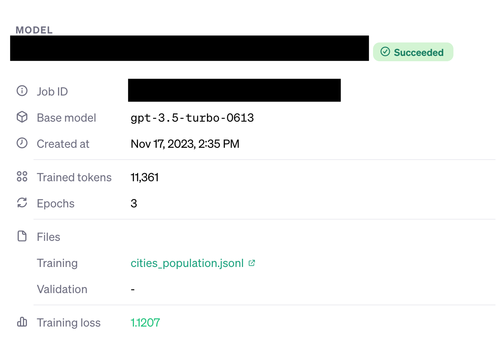

One question I often hear during project sales is, "Can we use our knowledge base to fine-tune a model and build a chatbot that can answer questions about it?"

The answer is no.

I mean, you [can](https://arxiv.org/abs/2312.05934), but it'll be costly and likely perform worse than a RAG system.

[Fine-tuning](https://platform.openai.com/docs/guides/fine-tuning/fine-tuning) isn't meant to add new information to your model. It's meant to change how your model behaves. Typical use cases of fine-tuning include:

- Ensuring the model responds in a specific way that it's hard to convey by just explaining it in a prompt.
- Learning to generate complex outputs, like in tasks that currently require a chain of prompts.
- Reduce the number of tokens you need and/or the latency of a request.

To _add_ new knowledge to a model you should use [Retrieval-augmented Generation (RAG)](https://blogs.nvidia.com/blog/what-is-retrieval-augmented-generation/). It doesn't actually add new knowledge per se. Instead, it provides relevant information to the model in the context used by the model.

Because this question keeps coming up, I decided to write some [sample code](https://github.com/dylanjcastillo/rag-vs-finetune) to demonstrate the difference. Here's what I did:

1. Created a synthetic dataset with information for the model to "store."
2. Fine-tuned a model using that dataset.
3. Built a small RAG pipeline with the same dataset.
4. Asked both the fine-tuned model and the RAG pipeline + vanilla model questions from the dataset.
5. Compared the accuracy of both models.

Let's dive in.

## Fine-tuning vs. RAG

For the first step, I generated a synthetic dataset with the population of fake cities as follows:

```python
import json
import random


random.seed(42)

scenarios = [
    {
        "messages": [
            {"role": "system", "content": "You're a helpful assistant"},
            {"role": "user", "content": f"What is the population of City_{i}?"},
            {"role": "assistant", "content": f"City_{i} has about {random.randint(100000, 10000000)} inhabitants."}
        ]
    } for i in range(1, 101)
]

jsonl_data = "\n".join(json.dumps(scenario) for scenario in scenarios)

with open("cities_population.jsonl", "w") as f:
    f.write(jsonl_data)
```

This code follows the [format](https://platform.openai.com/docs/guides/fine-tuning/example-format) defined by OpenAI for fine-tuning, creating 100 fake cities with random population values.

### Fine-tuning

Using that dataset, I fine-tuned `gpt-3.5-turbo`:

```python
import json

from dotenv import load_dotenv

load_dotenv() # to load OPENAI_API_KEY

from openai import OpenAI

client = OpenAI()

# Upload file
client.files.create(
  file=open("cities_population.jsonl", "rb"),
  purpose="fine-tune"
)

# Start fine-tuning (use FILE_ID returned after uploading the file)
client.fine_tuning.jobs.create(
  training_file=<FILE_ID>,
  model="gpt-3.5-turbo"
)
```

This code loads the `OPENAI_API_KEY` to the environment (it should be in an `.env` file), then uploads the file with the fake cities, and starts the fine-tuning.

This will take a few minutes. After it's over, you can try the model by copying the model ID in [Fine-tuning](https://platform.openai.com/finetune):



And running this code:

```python
response = client.chat.completions.create(
  model=<MODEL_ID>, # replace MODEL_ID to the id you got from the UI
  messages=[
    {"role": "system", "content": "You are a helpful assistant."},
    {"role": "user", "content": "What is the population of City_1?"},
  ]
)
```

Next, I built a simple RAG pipeline.

### RAG

I set up a [ChromaDB](https://docs.trychroma.com/) client and add data the I generated earlier to it, to use in the RAG pipeline:

```python
import json
import chromadb

chroma = chromadb.Client()
try:
    chroma.delete_collection("rag")
except:
    pass
chroma_collection = chroma.create_collection("rag")

with open("cities_population.jsonl", "r") as f:
    jsonl_data = f.read()

data = []
for row in jsonl_data.split("\n"):
    data.append(json.loads(row)["messages"])

assistant_responses = []
ids = []
for i, message in enumerate(data):
    assistant_responses.append(message[2]["content"])
    ids.append(str(i))

chroma_collection.add(
    documents=assistant_responses,
    ids=ids,
)
```

This function creates a new collection called `rag` in Chroma (and deletes it if it already existed), and adds the messages with the responses (i.e., "City_2 has a population of 580000 inhabitants").

## Comparing results

Then, I created a few [utility functions](https://github.com/dylanjcastillo/rag-vs-finetune/blob/master/compare_results.ipynb) to retrieve answers from the RAG pipeline and the fine-tuned model. Using these functions, I wrote a piece of code to get answers to the same question. Here's what I did:

```python
comparisons = []
for i, row in enumerate(data):
    question = row[1]["content"]
    documents = chroma_collection.query(
        query_texts=[question],
        n_results=5
    )
    response_comparison = {
        "response_model_ft": get_finetuned_answer(question),
        "response_model_rag": get_rag_answer(question, documents, "gpt-3.5-turbo-1106"),
        "answer": row[2]["content"],
        "question": question,
    }
    print(i, response_comparison)
    comparisons.append(response_comparison)
```

This generated a structure as follows with the answers:

```json
{
  "response_model_ft": "City_1 has about 6476472 inhabitants.",
  "response_model_rag": "City_1 has about 1967825 inhabitants.",
  "answer": "City_1 has about 1967825 inhabitants.",
  "question": "What is the population of City_1?"
}
```

Then, it was easy to extract the responses and check whether they were correct:

```python
import re

def extract_number(text):
    matches = re.findall(r"\s(\d+)", text)
    if len(matches) == 0:
        return None
    else:
        return int(matches[0])

correct_ft = 0
correct_rag = 0
for comparison in comparisons:
    ft_number = extract_number(comparison["response_model_ft"])
    rag_number = extract_number(comparison["response_model_rag"])
    answer_number = extract_number(comparison["answer"])
    print(ft_number, rag_number, answer_number)

    if ft_number == answer_number:
        correct_ft += 1
    if rag_number == answer_number:
        correct_rag += 1

print("Accuracy FT:", correct_ft / len(comparisons))
print("Accuracy RAG:", correct_rag / len(comparisons))
```

After running this code with the [data](https://github.com/dylanjcastillo/rag-vs-finetune/blob/master/cities_population.jsonl) I generated earlier, I got these results:

- **Fine-tuned model accuracy:** 0%
- **RAG + vanilla model accuracy:** 95%

You can check the [code](https://github.com/dylanjcastillo/rag-vs-finetune) for this article on GitHub.
